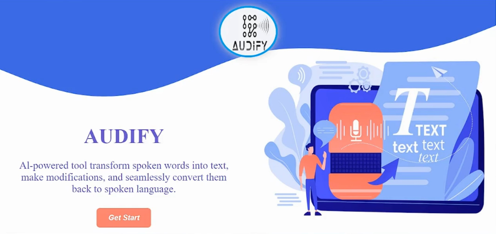

# Audify 🎙️

### AI Speech Editing & Voice Cloning Platform for Egyptian Arabic

Audify is an AI-powered platform that enables users to edit spoken audio by simply modifying the generated text transcript. The system then regenerates the edited speech while preserving the original speaker's voice using voice cloning technology.

**Graduation Project (A+)**

---

## 🚀 Features

* Speech-to-Text for Egyptian Arabic
* Text-Based Audio Editing
* Voice Cloning using XTTS-v2
* Fine-Tuned Models for Egyptian Dialect
* Custom Egyptian Arabic Dataset
* Web Interface Built with Flask
* End-to-End AI Audio Processing Pipeline

---

## 🏗️ System Architecture

```text
Audio Input
    ↓
Speech-to-Text
    ↓
Editable Transcript
    ↓
User Modifies Text
    ↓
Voice Cloning (XTTS-v2)
    ↓
Generated Audio Output
```

---

## 🧠 Technologies Used

### AI & Machine Learning

* Python
* PyTorch
* XTTS-v2 (Coqui AI)
* Speech Recognition
* Deep Learning
* Natural Language Processing (NLP)
* Generative AI

### Web Development

* Flask
* HTML
* CSS
* JavaScript

---

## 🔍 Project Highlights

* Created and prepared a custom Egyptian Arabic speech dataset.
* Performed audio preprocessing including noise reduction and silence trimming.
* Fine-tuned XTTS-v2 to clone speaker voices while maintaining natural speech quality.
* Built a complete workflow that converts speech into editable text and regenerates speech after modifications.
* Developed and deployed a web application using Flask.
* Optimized transcription and speech synthesis performance for Egyptian Arabic dialects.

---

## 📸 Screenshots

### Home Page



### Transcript Editing


### Generated Result


---

## 🎥 Demo

### Demo Video 1

(Add Demo Link)

### Demo Video 2

(Add Demo Link)

---

## ⚙️ Installation

```bash
git clone https://github.com/your-username/audify-egyptian-voice-cloning.git

cd audify-egyptian-voice-cloning

pip install -r requirements.txt

python app.py
```

---

## 📂 Project Structure

```text
audify-egyptian-voice-cloning/
│
├── app.py
├── requirements.txt
├── README.md
│
├── screenshots/
├── demos/
├── models/
├── dataset/
└── source_code/
```

---

## 👥 Team

Graduation Project Team

Faculty of Engineering / Computer Science / Artificial Intelligence

---

## 🏆 Project Outcome

Audify demonstrates how AI can simplify audio editing by allowing users to modify speech through text while preserving the speaker's original voice characteristics. The project focuses on Egyptian Arabic, addressing the challenges of dialect-specific speech recognition and voice synthesis.
